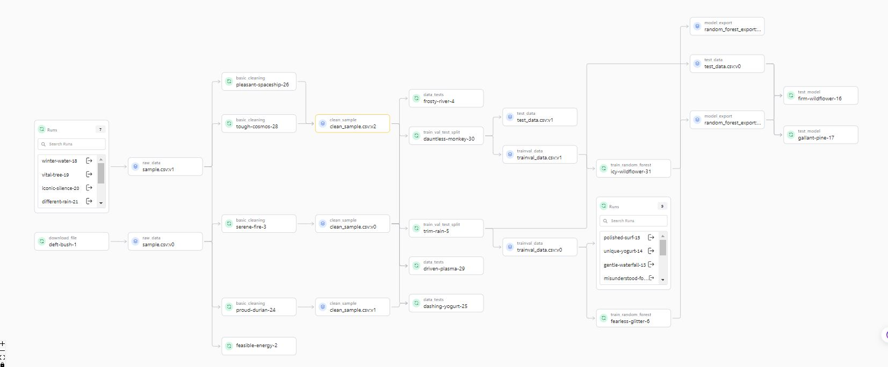

# Build an ML Pipeline for Short-Term Rental Prices in NYC

This repository hosts a Machine Learning (ML) pipeline tailored for predicting short-term rental property prices in New York City. The pipeline is designed with easy retraining in mind, accommodating the frequent influx of new data. Given the constantly changing prices, the model adapts accordingly. The pipeline consists of standard steps and components commonly found in short to medium-sized ML projects, detailed in the Introduction section.

The following tools are used:

- MLflow: Used for reproducibility and management of pipeline processes.
- Weights and Biases: Utilized for artifact and execution tracking.
- Hydra: Employed for configuration management.
- Conda: Utilized for environment management.
- Pandas: Used for data analysis.
- Scikit-Learn: Employed for data modeling.
- ydata_profiling : Alternative to pandas_profiling

Additionally, the tracked experiments collected by the Weights & Biases project can be found here: [nyc_airbnb](https://wandb.ai/adityakush1215/nyc_airbnb/).

The initial codebase for this repository originated as a fork from the Udacity project repository, "build-ml-pipeline-for-short-term-rental-prices." For detailed instructions on the original project, please refer to the file "Instructions.md" in the source repository.

If you're interested in understanding the importance of reproducible ML pipelines and how the tools utilized here interact, I invite you to explore my ML pipeline project boilerplate.

The dataset used in this project is a modified version of the AirBnB dataset specific to New York City, sourced from the original repository. AirBnB provides a comprehensive data dictionary explaining each feature. For this project, a subset of 15 independent variables has been selected for analysis.


## Table of contents

- [Build an ML Pipeline for Short-Term Rental Prices in NYC](#build-an-ml-pipeline-for-short-term-rental-prices-in-nyc)
  - [Table of contents](#table-of-contents)
    - [Indtroduction](#indtroduction)
    - [How to Use This Project](#how-to-use-this-project)
      - [Dependencies](#dependencies)
      - [How to run the pipeline:](#how-to-run-the-pipeline)
        - [Lineage / Graph View of the pipeline:](#lineage--graph-view-of-the-pipeline)
    - [How to Modify the Pipeline](#how-to-modify-the-pipeline)
    - [Issues](#issues)

### Indtroduction

This project can be forked from [Githb](https://github.com/adityakush1/build-ml-pipeline-for-short-term-rental-prices).
To view the pipeline in [Weights and Biases](https://wandb.ai/adityakush1215/nyc_airbnb/).

Below is the pipeline:


The file and folder structure:

```
├── README.md                       # Overview of the repository
├── MLproject                       # High-level pipeline project configuration
├── main.py                         # Main pipeline execution script
├── environment.yml                 # Environment file for running the project
├── conda.yml                       # Environment file for the main pipeline
├── config.yaml                     # Pipeline configuration settings
├── Instructions.md                 # Original instructions from Udacity
├── LICENSE.txt                     # License file
├── images/                         # Directory for Markdown assets
│   └── ...
├── cookie-mlflow-step/             # Template for generating empty steps
│   └── ...
├── components/                     # Remote components directory
│   ├── README.md
│   ├── conda.yml
│   ├── get_data/                   # Step/component for downloading data
│   │   ├── MLproject               # MLflow project file
│   │   ├── conda.yml               # Environment file for the step
│   │   ├── data/                   # Dataset samples (retrieved via URL)
│   │   │   ├── sample1.csv
│   │   │   └── sample2.csv
│   │   └── run.py                  # Step implementation
│   ├── test_regression_model/      # Evaluation step/component
│   │   ├── MLproject
│   │   ├── conda.yml
│   │   └── run.py
│   └── train_val_test_split/       # Segregation step/component
│       ├── MLproject
│       ├── conda.yml
│       └── run.py
└── src/                            # Local components directory
    ├── README.md
    ├── basic_cleaning/             # Cleaning step/component
    │   ├── MLproject               # MLflow project file
    │   ├── conda.yml               # Environment file for the step
    │   └── run.py                  # Step implementation
    ├── data_check/                 # Non-/Deterministic tests step/component
    │   ├── MLproject
    │   ├── conda.yml
    │   ├── conftest.py
    │   └── test_data.py
    ├── eda/                        # Exploratory Data Analysis & Modeling (research env.)
    │   ├── EDA.ipynb               # Notebook for basic EDA
    │   ├── MLproject
    │   └── conda.yml               # Environment file for the research environment
    └── train_random_forest/        # Inference pipeline
        ├── MLproject
        ├── conda.yml
        ├── feature_engineering.py
        └── run.py

```

Each step or component has its dedicated folder containing the following files:

run.py: Implementation of the step function or goal.
MLproject: MLflow project file executing run.py with the appropriate arguments.
conda.yaml: Conda environment required by run.py set by MLflow.

The execution of all components is managed by the root-level script main.py, which executes all steps sequentially based on the parameters specified in config.yaml.


### How to Use This Project
If you're new to the tools utilized in this project, I suggest reviewing my ML pipeline project template.
To get started:

- Install the necessary dependencies.
- Execute the pipeline according to the instructions provided in the corresponding section.
- Feel free to customize the pipeline based on these guidelines and considering the original Instructions.md.

#### Dependencies

```
# Clone the repository
git clone https://github.com/adityakush1/build-ml-pipeline-for-short-term-rental-prices.git
cd build-ml-pipeline-for-short-term-rental-prices

# Create a new environment
conda env create -f environment.yml

# Activate the environment
conda activate nyc_airbnb_dev

# Log in via the API key
wandb login <api key>
```

MLflow manages all dependencies for each step or component using the respective conda.yaml.

#### How to run the pipeline:
There are multiple ways to run this pipeline. Below is a summary for same:

- Running the pipeline locally or executing it from the cloned source code.
- Executing specific pipeline steps locally.
- Performing a remote execution of a release.

Below are example commands demonstrating each approach:

```
# Navigate to the root project level, where main.py is located
cd ml_pipeline_rental_prices

# Execute the entire pipeline locally
mlflow run . 

# Execute the "download" step
mlflow run . -P steps="download"

# Execute the "basic_cleaning" step
# Note: This step needs artifact from upstream
mlflow run . -P steps="basic_cleaning"


# Execute the "data_check" and "data_split" steps
# Note: This step needs artifact from upstream
mlflow run . -P steps="data_check,data_split"


# Note: This step needs artifact from upstream
# Perform hyperparameter variation using Hydra sweeps
# Execute the "train_random_forest" step
mlflow run . \
-P steps=train_random_forest \
-P hydra_options="modeling.max_tfidf_features=10,15,30 modeling.random_forest.max_features=0.1,0.33,0.5,0.75,1.0 -m"


# To execute a remote release hosted in my repository
# use a different dataset
# Release: 1.0.3
mlflow run https://github.com/adityakush1/build-ml-pipeline-for-short-term-rental-prices\
-v 1.0.1 \
-P hydra_options="etl.sample='sample2.csv'"

```

After each execution, various outputs are generated, including:
- Auxiliary tracking files and directories such as wandb, mlruns, artifacts, etc., which can be disregarded.
- Entries in the associated Weights and Biases project.

The entries in the Weights and Biases web interface provide comprehensive details for each run, including:
- Time, duration, and resource usage.
- Logged information such as parameters, metrics, images, etc.
- Git commit branches.
- Relationships between components and artifacts.

##### Lineage / Graph View of the pipeline:

### How to Modify the Pipeline

Creating new steps or components is straightforward. Simply follow these steps:

- Create a new folder under src/ with the following three files, properly implemented:

  * MLproject
  * conda.yaml
  * run.py

Add the step and its parameters to the MLflow pipeline in main.py, following the same structure used for other steps.

Instead of manually creating the folder and files, we can leverage the cookiecutter tool, which is included in the general requirements. To do so, run the following command:
```
cookiecutter cookie-mlflow-step -o src
```
This command prompts a form via the command-line interface (CLI) that we need to fill in. For example, if we want to create a new component for training an XGBoost model, we could provide the following information:

```
step_name [step_name]: train_xgboost
script_name [run.py]: run.py
job_type [my_step]: train_model
short_description [My step]: Training an XGBoost model
long_description [An example of a step using MLflow and Weights & Biases]: Training an XGBoost model
parameters [parameter1,parameter2]: trainval_artifact,val_size,random_seed,stratify_by,xgb_config,max_tfidf_features,output_artifact
```

This process automatically creates the component folder with the three required files, ready to be implemented.

### Issues
There are a few deviations from the original Instructions.md that are worth noting:

- I made adjustments to several conda.yaml files to address versioning and dependency issues, such as protobuf, etc.
- I used ydata_profiling instead of pandas_profiling to achieve similar task due to version conflict.
- mlflow relies on cached conda env once created, so when running in verion issue, follow below steps as I did to resolve conflict and update conda.yml:
  ```
  #to activate mlflow env
  conda activate <mlflow-env>
  
  #e.g. to istall scikit learn 1.0.2 when base env having 1.3.2
  pip install scikit-learn==1.0.2

  #deactivate mlflow env
  conda deactivate
  ```
  This overrides conda's conflict resolution to force installation of specified version

Author:
Aditya Kushwaha
